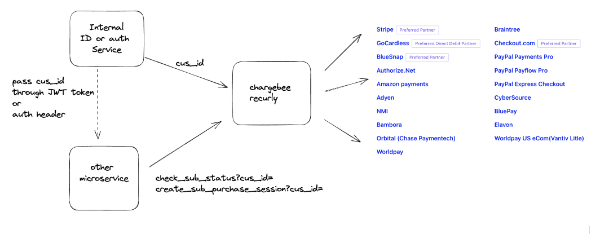
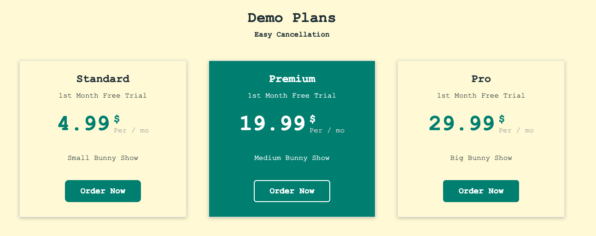
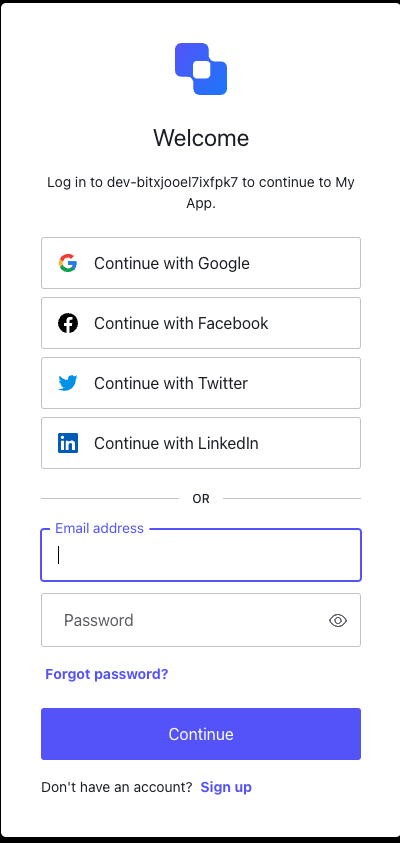
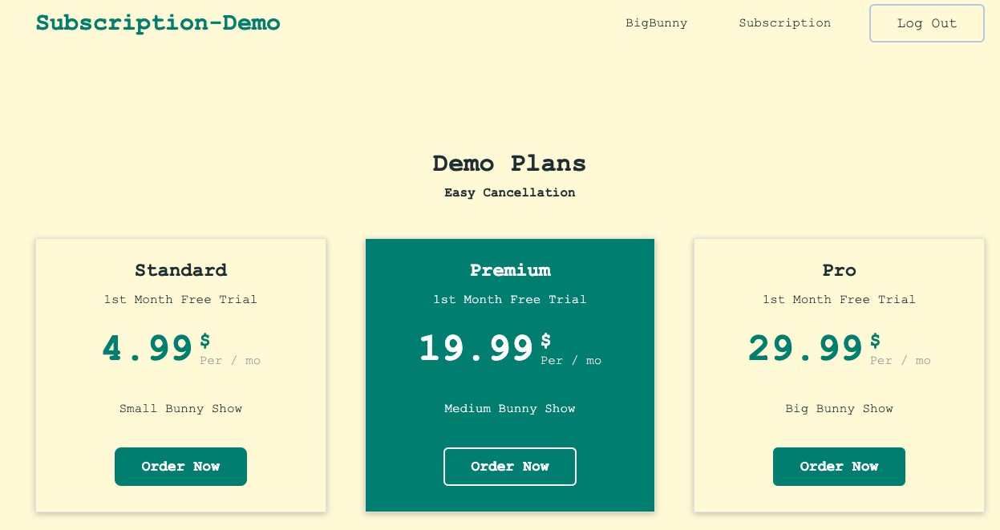
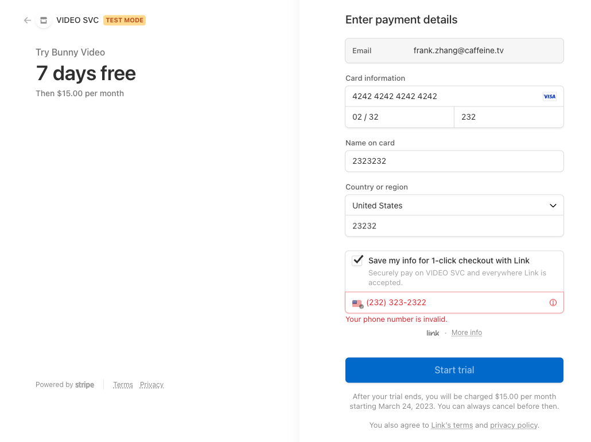
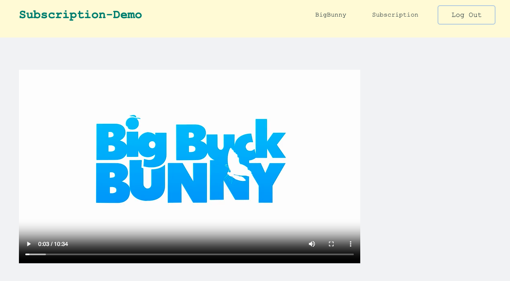
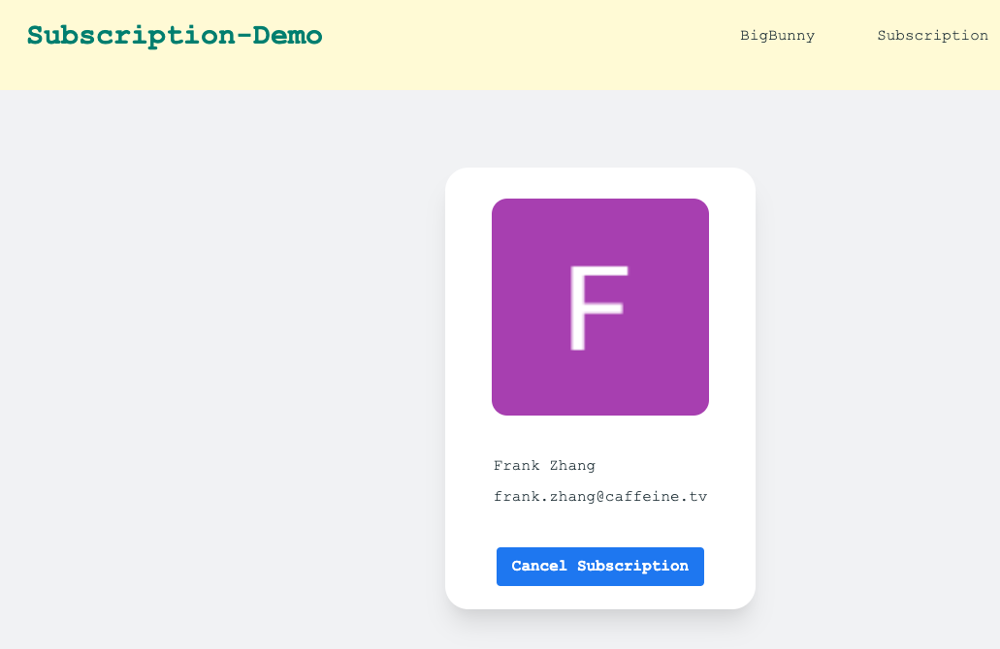
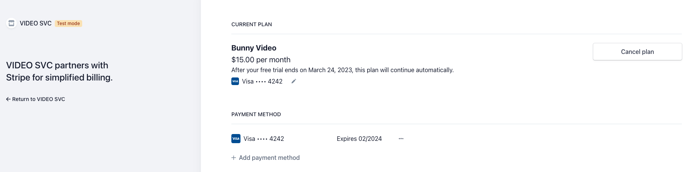

This is for local demo only. 
There is no infra code

*Programming Model*

This demo is to integrate external subscription service to existing backends with minimum efforts. 
In the demo, user can login with their social identity and then purchase a subscription. After a successful purchase, the demo will delivery big bunny video to the user. If user cancels the subscription, the demo will stop deliver the video.  

In the backend, the user identify service appends the user subscription info in the JWT token each time user logs in.
The fullfillment services will look at the subscription info directly from JWT token to make video delivery decision. 
In the frontend, the existing code does not need to know the subscription information.

The external subscription service will handle:
<ul>
<li>
user payments
</li>
<li>
user subscription relationship
</li>
<li>
subscription managment
</li>
<li>
refund management
</li>
<li>
user stats reporting
</li>
</ul>

In this demo, we use `Auth0` as user identity service and we use `stripe` subscription directly on the backend. We use `react` and `tailwind` in the frontend. 

*Step 1 - Plan Overview*
**FE** 
 

*Step 2 - Login to Order*
**BE** 
**FE**
 

*Step 3 - Click to buy the subscription after login*
**BE** 
**FE**
 

*Step 4 - Enjoy the video after sub purchase *
**BE** 
**FE**
 

*Step 4 - Cancel subscriptions *
**BE** 
**FE**
 

